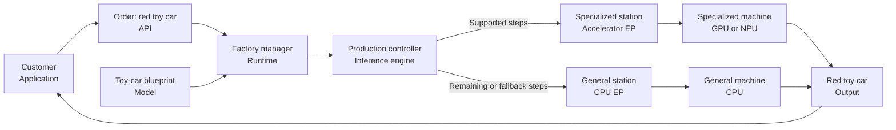

# 02 - API vs runtime vs engine

An inference application contains several layers. These layers are easy to
confuse because one product may provide more than one of them.

- An **API** is the interface your application calls.
- A **runtime** loads a model, manages resources, and schedules model
  operations.
- An **inference engine** executes and optimizes the model's computations.
- A **backend or execution provider (EP)** connects the engine to a hardware
  path such as a CPU, GPU, or NPU.
- The **hardware** performs the selected computations.

A high-level API can hide the runtime, engine, model, and hardware selection. A
lower-level runtime API exposes more of those choices to the application
developer.

## Goals

By the end of this lesson, you should be able to:

1. explain the difference between an API, runtime, engine, backend, and hardware;
2. read the layer stack printed by the lab's `explain` command;
3. identify which decisions belong to you, the runtime, or Windows;
4. compare high-, middle-, and low-level inference paths; and
5. explain the trade-off between convenience and control.

This lesson describes three inference paths, but it does not run a model.
`READY` or `UNAVAILABLE` reports installation readiness only, not proof of model
execution.

## Before you begin

Open PowerShell in the repository root and activate the environment you used in
Lesson 1:

```powershell
.\.venv\Scripts\Activate.ps1
```

Confirm that the lab is available:

```powershell
python -m local_ai_lab --help
```

If Python reports `No module named local_ai_lab`, verify the active Python:

```powershell
python -c "import sys; print(sys.executable)"
```

The path should end with `.venv\Scripts\python.exe`. Return to the first-time
setup in Lesson 1 only if this environment has not been installed.

## Factory analogy

Imagine a factory that receives an order for a **red toy car**. It uses a toy-car
blueprint, production software, specialized stations, and physical machines to
produce the requested toy.

| Inference layer | Factory equivalent | Responsibility |
|---|---|---|
| Application | Customer | Requests a red toy car and receives it |
| API | Toy order form | Defines fields such as product and color |
| Runtime | Factory manager | Loads the toy-car blueprint, reserves machines, and schedules production |
| Inference engine | Production controller | Reads, optimizes, and executes the blueprint's production steps |
| Backend / EP | Production station | Accepts supported steps and translates them into machine instructions |
| Hardware | Assembly, painting, and general-purpose machines | Physically performs assigned steps |
| Model | Toy-car blueprint | Defines how the input order is transformed into a toy car |
| Output | Red toy car | Completed result returned to the customer |



Follow the red toy car through the factory:

1. The customer selects `toy car` and `red` on the order form (**the application
   sends input through the API**).
2. The factory manager loads the toy-car blueprint, reserves machines, and
   schedules the job (**the runtime loads the model and coordinates execution**).
3. The production controller reads the blueprint and organizes its steps, such
   as molding the body, painting it red, and attaching the wheels (**the
   inference engine optimizes and executes model operations**).
4. A specialized station accepts the steps it supports and translates them into
   instructions for its machine (**an accelerator EP maps supported operations
   to a GPU or NPU**).
5. The general station handles remaining or fallback steps (**the CPU EP maps
   those operations to the CPU**).
6. The machines complete their assigned steps, and the factory returns the red
   toy car to the customer (**the runtime returns output through the API**).

A factory can have several stations. A specialized station may perform some
operations while a general-purpose station handles unsupported ones. Likewise,
an available GPU or NPU EP does not prove that it executed every model
operation. Runtime evidence is needed to identify which providers and devices
actually performed the work.

## How to read `explain`

The command format is:

```powershell
python -m local_ai_lab explain <inference-path>
```

Each result has five important sections:

1. **PATH** - layers from your application down to the model.
2. **YOU CONTROL** - choices exposed directly to your code.
3. **RUNTIME CONTROLS** - decisions delegated to runtime software.
4. **WINDOWS CONTROLS** - decisions delegated to the operating system.
5. **EVIDENCE / READINESS** - whether required software or configuration is
   currently available.

The responsibility table gives more detail about ownership. The line
`ACTUAL EXECUTION DEVICE: unknown / runtime-managed` is intentional: describing
an architecture does not prove which device executed a real model.

The path also names the model artifact or representation. This is not meant to
suggest that a model is physically "after" the hardware. The runtime loads the
model, and the diagram includes it so you can see who supplies it and in what
format.

## Step 1: Inspect a high-level API

Run:

```powershell
python -m local_ai_lab explain windows-ai-api
```

A shortened example is:

```text
PATH: Windows AI task-specific APIs
Application
  | v
Windows AI task-specific WinRT API
  | v
Windows-managed implementation
  | v
unknown / runtime-managed
  | v
Windows-selected backend
  | v
NPU where the specific API contract guarantees it
  | v
Windows-managed system model

YOU CONTROL
- task inputs
- limited API-specific options

WINDOWS CONTROLS
- model distribution, compatibility and hardware selection

ACTUAL EXECUTION DEVICE: unknown / runtime-managed
```

Interpretation:

- Your application asks for a task through a Windows API.
- Windows manages most implementation details, including the system model and
  supported hardware path.
- Your code gains simplicity but cannot freely choose the model format, runtime,
  or backend.
- An NPU claim is valid only where a specific API contract and readiness
  evidence guarantee it.

The readiness section may say `UNAVAILABLE` because this lab is running through
Python and the Windows AI APIs use a C# or C++ WinRT path. That is an expected
result and does not prevent you from completing this lesson.

Record:

| Question | Windows AI API answer |
|---|---|
| Who chooses the model? | Windows |
| Who chooses the hardware path? | Windows |
| Can the application select an ORT EP? | No |
| How much implementation detail is visible? | Little |

## Step 2: Inspect a managed local runtime

Run:

```powershell
python -m local_ai_lab explain foundry-local
```

A shortened example is:

```text
PATH: Foundry Local
Application
  | v
Foundry Local Python SDK or OpenAI-compatible endpoint
  | v
Foundry Local Core
  | v
ONNX Runtime
  | v
Windows ML-registered EP
  | v
unknown / runtime-managed
  | v
Catalog-selected optimized ONNX artifacts

YOU CONTROL
- catalog alias/model
- prompt
- generation parameters
- cache lifecycle

RUNTIME CONTROLS
- artifact selection/compilation
- tokenization
- KV cache
- generation

ACTUAL EXECUTION DEVICE: unknown / runtime-managed
```

### Where ONNX Runtime fits

Foundry Local Core **uses ONNX Runtime internally**, but the two are not
synonyms:

```text
Foundry Local Core
  - manages model lifecycle, tokenization, KV cache, and generation
  |
  +--> ONNX Runtime
         - loads and executes the optimized ONNX graph
         |
         +--> Execution Provider
                - maps supported graph operations to CPU, GPU, or NPU
```

Foundry Local Core is the higher-level orchestration layer. It delegates model
graph execution to ONNX Runtime. ONNX Runtime then delegates supported
operations to one or more EPs. Therefore, ORT is an internal execution
dependency beneath Foundry Local Core; it is not the whole of Foundry Local
Core.

### Two Foundry Local Python variants

Foundry Local provides two Python packages. They expose the same high-level
Foundry Local API, but use different native runtime distributions:

| Variant | Python package | Platform | How execution providers are supplied |
|---|---|---|---|
| Standard, cross-platform | `foundry-local-sdk` | Windows, Linux, and macOS on Apple silicon | Foundry Local Core directly registers the backends packaged for that platform, such as CPU, WebGPU, or CUDA where supported |
| Windows ML | `foundry-local-sdk-winml` | Windows only | Windows ML discovers, acquires, registers, and services compatible EPs for the Windows device |

The application code at the top remains similar:

```text
Application
  |
  +--> Foundry Local Python API
         - select, download, load, and run a catalog model
```

The architecture below the API differs.

**Standard cross-platform path:**

```text
Application
  |
foundry-local-sdk
  |
Foundry Local Core
  |
ONNX Runtime
  |
Core-registered EP packaged for the platform
  |
CPU, GPU, or another supported device
```

Foundry Local ships the native Core and runtime dependencies appropriate for the
operating system. Core registers the packaged backend directly with ORT. This
design provides one Foundry Local programming model across Windows, Linux, and
macOS, although the available backends differ by platform.

**Windows ML path:**

```text
Application
  |
foundry-local-sdk-winml
  |
Foundry Local Core for Windows ML
  |
ONNX Runtime with Windows ML integration
  |
EP acquired and registered by Windows ML
  |
CPU, GPU, or NPU
```

Windows ML is the Windows-specific platform layer. It discovers compatible
hardware EPs, acquires and registers them, and coordinates runtime and driver
compatibility. This path is useful when a Windows application needs
Windows-managed access to vendor CPU, GPU, or NPU acceleration.

In both paths, Foundry Local Core still manages the catalog model, tokenization,
generation, and lifecycle. ORT still executes the model graph. The difference
is who supplies and manages the hardware-specific EP layer.

The two packages use different native Core distributions and must not be
installed in the same Python environment. Use separate virtual environments if
you need to compare them:

```powershell
# Standard cross-platform variant
py -3.12 -m venv .venv-foundry-standard
.\.venv-foundry-standard\Scripts\python.exe -m pip install -e ".[dev]"
.\.venv-foundry-standard\Scripts\python.exe -m pip install foundry-local-sdk

# Windows ML variant
py -3.12 -m venv .venv-foundry-winml
.\.venv-foundry-winml\Scripts\python.exe -m pip install -e ".[foundry]"
```

In this repository, the `foundry` extra installs
`foundry-local-sdk-winml`. Installing an SDK only establishes software
readiness; runtime evidence is still required to prove which EP and device
executed a model.

For current platform and package details, see the official
[Foundry Local architecture](https://learn.microsoft.com/azure/foundry-local/concepts/foundry-local-architecture)
and
[SDK reference](https://learn.microsoft.com/azure/foundry-local/reference/reference-sdk-current).

Interpretation:

- Your application selects a catalog model and supplies prompts and generation
  settings.
- Foundry Local's **catalog and lifecycle layer** resolves that selection to a
  compatible optimized model variant, acquires its files, and keeps them in the
  local cache. The developer chooses the model; Foundry Local manages the
  downloaded copy.
- Foundry Local **Core**, its inference runtime, loads the selected model and
  tokenizer assets. It converts the prompt to tokens, invokes ONNX Runtime,
  manages the generation loop and KV cache, and converts generated tokens back
  to text. The application supplies the prompt and generation settings, but it
  does not implement those steps itself.
- ONNX Runtime is still part of the stack, but your application does not create
  and configure a raw ORT session.
- Windows ML participates in EP discovery and registration.
- The actual hardware remains unknown until runtime evidence demonstrates it.

The readiness section may say `UNAVAILABLE` if the Foundry Local SDK or endpoint
is not configured. Do not install it merely to complete this comparison.

Record:

| Question | Foundry Local answer |
|---|---|
| Who selects the catalog model? | The developer |
| Who manages the downloaded model files? | Foundry Local's catalog/lifecycle layer acquires, selects, and caches the optimized model variant |
| Who handles tokenization and generation? | Foundry Local Core loads the tokenizer assets and runs tokenization, generation, sampling, and KV-cache management |
| What does ONNX Runtime do inside Foundry Local? | It executes the optimized ONNX graph and uses EPs to map supported operations to hardware |
| Can the application directly place every operator? | No |

## Step 3: Inspect a low-level runtime API

Run:

```powershell
python -m local_ai_lab explain onnx-runtime
```

A shortened example is:

```text
PATH: ONNX Runtime direct
Application
  | v
ONNX Runtime Python API
  | v
ONNX Runtime
  | v
ORT graph executor
  | v
CPUExecutionProvider (default unless configured)
  | v
unknown / runtime-managed
  | v
ONNX

YOU CONTROL
- ONNX model
- session options
- provider order/options
- input tensors

RUNTIME CONTROLS
- graph optimization
- operator placement and execution

ACTUAL EXECUTION DEVICE: unknown / runtime-managed
```

Interpretation:

- Your application supplies the ONNX model and correctly shaped input tensors.
- Your application can request and order available EPs.
- ORT optimizes the graph and assigns supported operations to providers.
- Requesting an EP is configuration, not proof that all operations ran on its
  hardware.
- Direct ORT accepts tensors. It does not automatically provide an LLM prompt,
  tokenizer, sampling loop, or chat interface.

The readiness section can list available EPs:

```text
READY onnx-runtime: ONNX Runtime is importable.
  Available EPs: CPUExecutionProvider
```

Your list may differ. This line reports providers exposed by the installed ORT
distribution; it does not report a measured model run.

Record:

| Question | Direct ONNX Runtime answer |
|---|---|
| Who provides the model? | The developer/application |
| Who prepares input tensors? | The developer/application |
| Who requests the provider order? | The developer/application |
| Who performs graph optimization and operator placement? | ONNX Runtime |

## Step 4: Compare the paths

Complete this table using your command output:

| Decision | Windows AI API | Foundry Local | Direct ORT |
|---|---|---|---|
| Task input or prompt | Developer | Developer | Developer prepares tensors |
| Model selection | Windows-managed | Developer selects from catalog | Developer supplies ONNX |
| Model distribution | Windows | Foundry Local catalog/cache | Developer |
| Tokenization | Hidden/API-specific | Foundry Local | Developer/model-specific |
| Provider selection | Windows | Runtime/catalog/Windows ML | Developer requests provider order |
| Operator placement | Hidden | Runtime-managed | ORT-managed |
| Actual device proven by `explain` | No | No | No |
| Relative abstraction | High | Middle | Low |

Now answer these questions:

1. Which path gives the developer the fewest controls?
2. Which path makes the developer responsible for the model and input tensors?
3. Which path lets the developer request an EP order?
4. What happens to developer responsibility as abstraction becomes lower?

Expected answers:

1. Windows AI task-specific APIs.
2. Direct ONNX Runtime.
3. Direct ONNX Runtime.
4. Developer control increases, but setup, validation, and integration
   responsibility also increase.

## Common mistakes

### "`UNAVAILABLE` means the architecture description is invalid"

No. The path and responsibility sections describe the integration model. The
readiness section separately reports whether your current environment can use
that path.

### "The API is the runtime"

Not necessarily. An API is the surface your code calls. It may delegate to one
or several runtime and engine layers.

### "ONNX is the engine"

No. ONNX is a model representation. ONNX Runtime is runtime software that can
load and execute ONNX models.

### "I selected an EP, so the model ran entirely on its device"

No. Provider selection is configured intent. Runtime session reports, profiling,
and fallback checks are needed to establish what executed where.

### "A higher-level API is always better"

No. It is often easier, but it exposes fewer controls. The appropriate level
depends on whether the application values convenience, portability, detailed
provider control, custom preprocessing, or another requirement.

## Completion check

You are ready for Lesson 3 when all of the following are true:

- all three `explain` commands complete, even if one or more readiness sections
  say `UNAVAILABLE`;
- your comparison table identifies who owns model selection, tokenization,
  provider selection, and operator placement for each path;
- you can describe the stack in this order:
  **application -> API -> runtime/engine -> backend or EP -> hardware**, and
  explain that the runtime loads a model artifact;
- you can explain that higher abstraction usually provides less control and
  less integration work;
- you can explain that lower abstraction usually provides more control and more
  developer responsibility; and
- you label the actual execution device as **unknown** because `explain` did not
  run or profile a model.

Expected conclusion:

> An API is what my application calls, a runtime coordinates model execution,
> an engine performs and optimizes the computations, and a backend or EP connects
> execution to supported hardware. Different inference paths expose or hide
> these layers, so convenience and developer control vary.
