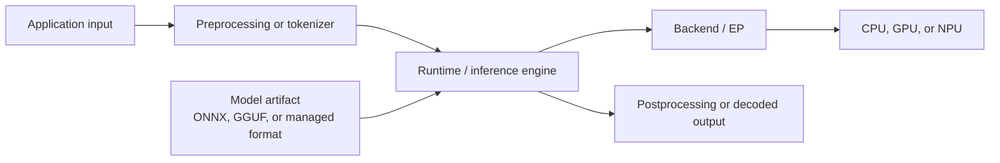
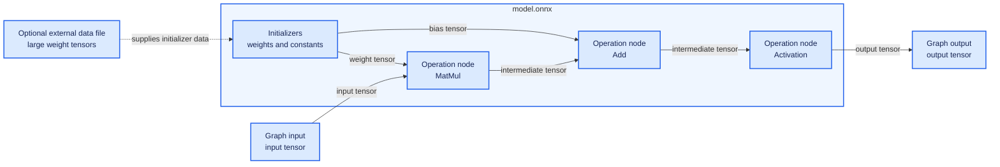
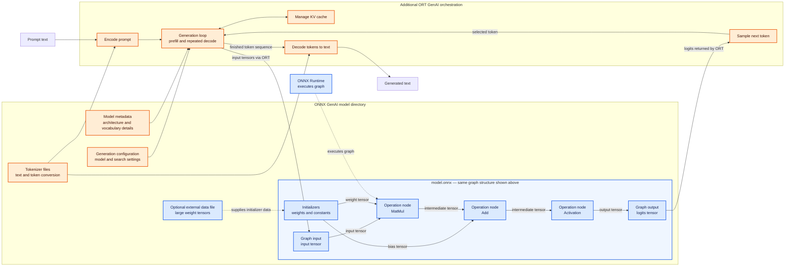
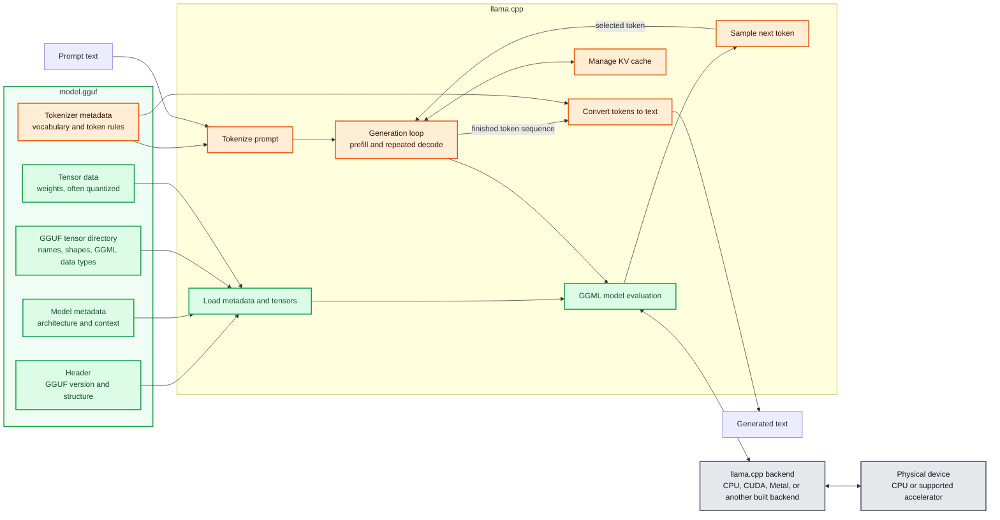

# 03 - Model format

To run inference, a runtime needs a concrete model artifact: files containing the model's learned weights, computation structure, metadata, and sometimes tokenizer or generation
configuration.

A **model format** defines how those artifacts are represented. The format helps
determine which runtimes can load the model, but it is not a runtime, execution
provider, or hardware device.

## Goals

By the end of this lesson, you should be able to:

1. distinguish a model family, model artifact, format, and configuration;
2. explain the main roles of ONNX, an ONNX GenAI model directory, and GGUF;
3. identify which runtime in this lab consumes each format;
4. explain why a format does not prove which device will execute a model;
5. explain what quantization changes; and
6. decide whether two model artifacts can support a fair performance comparison.

This lesson inspects configuration templates. It does not download or run a
model.

## Before you begin

Open PowerShell in the repository root and activate the environment used in the
previous lessons:

```powershell
.\.venv\Scripts\Activate.ps1
```

Confirm that the lab is available:

```powershell
python -m local_ai_lab --help
```

If Python reports `No module named local_ai_lab`, verify that the active Python
path ends with `.venv\Scripts\python.exe`:

```powershell
python -c "import sys; print(sys.executable)"
```

## Four terms that should not be confused

Imagine a publisher preparing a cookbook:

| Model concept | Cookbook equivalent | Example |
|---|---|---|
| Model family | The cookbook title and recipe collection | A named language-model family |
| Model artifact | A particular published edition | One exact set of model files |
| Model format | How that edition is packaged | ONNX or GGUF |
| Model configuration | A library record saying where it is and how to open it | YAML with path, format, and provider |

Two books can have the same title but differ in edition, language, page size, or
printing quality. Similarly, two artifacts from the same model family can differ
in revision, precision, quantization, graph structure, tokenizer, context
length, and runtime-specific optimization.

The model family name alone is therefore not enough to establish that two files
are equivalent.

## Where the model fits



The runtime loads the model artifact. The backend or EP maps supported
operations to hardware.

## The formats used in this lab

### ONNX

ONNX represents a computation graph:

- **nodes** describe operations such as matrix multiplication or convolution;
- **edges** carry tensors between operations;
- **initializers** contain learned weights and constants; and
- **inputs and outputs** describe the graph's tensor interface.

An ONNX model is commonly stored as one `.onnx` file, although large models can
store weight data in separate external files.



In the diagram, rectangles inside `model.onnx` are graph components. The arrows
between operation nodes are **edges** carrying tensors. Initializers supply
learned weights and constants, while graph inputs and outputs define the
interface used by the application. For large models, initializer data can live
in a separate external data file referenced by the ONNX file. **Blue** identifies
the ONNX artifact and graph concepts throughout this lesson.

ONNX is designed for runtime portability, but portability is not automatic.
Compatibility still depends on:

- the ONNX opset and operators used by the graph;
- tensor data types and shapes;
- runtime and EP support for those operators;
- preprocessing and postprocessing expected by the model; and
- any graph transformations required by the target provider.

In this lab, direct ONNX models are consumed by **ONNX Runtime (ORT)**.

### ONNX GenAI model directory

A generative model needs more than one tensor evaluation. It also needs language
model behavior such as tokenization, repeated decoding, sampling, and KV-cache
management.

An ONNX GenAI artifact is therefore represented as a **directory** rather than
just one `.onnx` path. Depending on the model, the directory can contain:

- one or more ONNX model graphs;
- tokenizer files;
- generation configuration;
- model metadata; and
- runtime-specific configuration.



In the diagram:

- **Blue boxes repeat the first ONNX visual**: the same graph inputs,
  initializers, operation nodes, tensor edges, graph output, optional external
  weights, and ONNX Runtime execution.
- **Orange boxes** are the additional generative assets and orchestration:
  tokenization, generation configuration and metadata, prefill/decode looping,
  sampling, KV-cache management, and conversion back to text.

The difference can be summarized as follows:

| Concern | Direct ONNX Runtime | Additional ONNX GenAI layer |
|---|---|---|
| Artifact | ONNX graph and weights | Coordinated directory containing graphs plus tokenizer and generation assets |
| Application input | Correctly prepared tensors | Prompt text or token IDs |
| Execution | Runs the graph when the application calls `session.run()` | Repeatedly invokes the graph for prefill and decode |
| Tokenization | Application-specific responsibility | Loaded from model assets and managed by ORT GenAI |
| Generation state | Application/model-specific | KV cache and generation state managed across decode steps |
| Token selection | Application must implement it | Sampling uses the generation configuration |
| Result | Output tensors | Decoded generated text or tokens |

An ONNX graph can contain a generative model, but direct ONNX Runtime only
executes the graph. It does not automatically turn a prompt into tokens, run the
multi-step generation loop, select tokens, maintain the KV cache, or decode the
result into text. Those are the extra responsibilities supplied by ORT GenAI.

In this lab, an ONNX GenAI directory is consumed by **ORT GenAI**, which adds a
generation loop above ONNX Runtime.

### GGUF

GGUF packages model tensors and metadata for the **GGML/llama.cpp ecosystem**.
It is commonly used for local generative models and often contains quantized
weights.

A `.gguf` file can include information needed by llama.cpp, such as:

- model architecture metadata;
- tensor names, shapes, and data;
- quantization types; and
- tokenizer-related metadata.



In the diagram:

- **Orange boxes** are generative concepts corresponding to the orange ONNX
  GenAI boxes: tokenizer assets, tokenization, the generation loop, sampling,
  KV-cache management, and conversion back to text.
- **Green boxes** are specific to the GGUF/llama.cpp path: the GGUF header,
  architecture metadata, GGML tensor representation, container loading, and
  GGML model evaluation.
- **Gray boxes** are the selected llama.cpp backend and physical hardware.

GGUF keeps model metadata and tensor data in one container. llama.cpp reads that
container, performs tokenization and generation, and sends computations through
a backend available in its build. Quantization information belongs to tensors,
so one GGUF file can contain tensors stored using different GGML data types.

### ONNX GenAI and GGUF at the same stages

The two paths solve similar application-level problems, but their artifacts and
execution stacks are organized differently:

```mermaid
flowchart TB
    subgraph ONNXPATH["ONNX GenAI path"]
        OA["Tokenizer and generation assets"]
        OD["ONNX graph and weights"]
        OG["ORT GenAI<br/>generation orchestration"]
        ORT2["ONNX Runtime<br/>graph execution"]
        OEP["ORT Execution Provider"]
        OHW["CPU, GPU, or NPU"]
        OA --> OG
        OG --> ORT2
        OD --> ORT2
        ORT2 --> OEP --> OHW
    end

    subgraph GGUFPATH["GGUF path"]
        GA["Tokenizer metadata"]
        GF["GGUF structure<br/>header + model metadata + tensors"]
        LG["llama.cpp<br/>generation orchestration"]
        LE["llama.cpp/GGML<br/>model evaluation"]
        LB["llama.cpp backend"]
        GHW["CPU or supported accelerator"]
        GA --> LG
        LG --> LE
        GF --> LE
        LE --> LB --> GHW
    end

    classDef onnx fill:#dbeafe,stroke:#2563eb,color:#172554,stroke-width:2px
    classDef genai fill:#ffedd5,stroke:#ea580c,color:#431407,stroke-width:2px
    classDef gguf fill:#dcfce7,stroke:#16a34a,color:#14532d,stroke-width:2px
    classDef execution fill:#e5e7eb,stroke:#4b5563,color:#111827,stroke-width:2px
    class OD,ORT2 onnx
    class OA,OG,GA,LG genai
    class GF,LE gguf
    class OEP,OHW,LB,GHW execution
```



| Stage | ONNX GenAI | GGUF with llama.cpp |
|---|---|---|
| Artifact packaging | Directory containing ONNX graph files and supporting assets | Typically one GGUF container; large models can use multiple shards |
| Computation definition | Explicit ONNX operation graph | Architecture metadata plus tensors interpreted by llama.cpp's implementation |
| Tokenizer assets | Usually separate files in the directory | Commonly stored as GGUF metadata |
| Generation orchestration | ORT GenAI | llama.cpp |
| Model execution | ONNX Runtime executes graph nodes | llama.cpp/GGML implements and evaluates the architecture |
| Hardware connection | ORT execution provider | Backend compiled into or loaded by llama.cpp |
| Quantization representation | ONNX tensor types and graph patterns such as QDQ | GGML tensor types recorded in GGUF |
| Execution evidence | Runtime providers and profiling | llama.cpp startup/backend logs and timing evidence |

Across all three visuals:

- **Blue** always means ONNX graph representation or ONNX Runtime execution.
- **Orange** always means generative assets or orchestration, regardless of
  whether ORT GenAI or llama.cpp supplies it.
- **Green** always means GGUF representation or llama.cpp/GGML model execution.
- **Gray** always means the backend and physical hardware.

The colors compare responsibilities, not file compatibility. GGUF is not created
by adding components to ONNX, and an ONNX GenAI directory is not a GGUF file
split into several files.

GGUF is not a generic replacement for ONNX. It is designed around the
llama.cpp/GGML execution ecosystem. In this lab, GGUF is consumed by
**llama.cpp**.

### Provider-managed format

A cloud inference service can hide its internal artifact format. The client
usually supplies a provider model ID instead of a local file path.

`provider-managed` means the service provider owns the model packaging,
deployment, runtime, and hardware details. It does not mean that the model has
no format; it means the client cannot inspect or control that format through
this lab.

### Compiled or provider-specific artifacts

Some execution providers transform an ONNX graph into an optimized or compiled
artifact for a particular device, driver, input shape, or provider version.
That artifact is derived from the model but is not a new model family.

For example:

```text
Portable ONNX model
    |
    +--> runtime/provider validation
    |
    +--> graph partitioning and optimization
    |
    +--> provider-specific compiled artifact or cache
    |
    +--> target GPU or NPU
```

Such an artifact may not be portable to a different device or software version.
Its existence also does not by itself prove that every operation ran on the
accelerator.

## Format-to-runtime map

| Artifact format | Typical artifact | Runtime in this lab | Input level |
|---|---|---|---|
| ONNX | `.onnx`, possibly with external weight files | ONNX Runtime | Tensors |
| ONNX GenAI directory | Graphs plus tokenizer and generation configuration | ORT GenAI | Prompts/tokens through GenAI APIs |
| GGUF | `.gguf` | llama.cpp | Prompts/tokens through llama.cpp |
| Provider-managed | Remote provider model ID | Cloud service | Provider API request |

The table describes expected compatibility, not execution readiness. The
runtime must still be installed, the artifact must exist, and any requested EP
must support the graph.

## Step 1: List the model configurations

Run:

```powershell
python -m local_ai_lab models
```

A shortened example is:

```text
Configuration       Format                 Quantization   Path
cloud_example       provider-managed       unknown        -
llama_example       GGUF                   replace-with-  -
onnx_cpu_example    ONNX                   fp32           C:\models\replace-me.onnx
onnx_qnn_example    ONNX                   int8-qdq       C:\models\replace-me.qdq.onnx
ort_genai_example   ONNX GenAI directory   unknown        C:\models\replace-me
```

Your terminal may shorten long cells with an ellipsis. This does not change the
configuration files.

Interpret the output carefully:

- each row describes a **configuration template**;
- `C:\models\replace-me...` is a placeholder, not a bundled model;
- `-` means that the template does not currently provide a local path;
- `unknown` means the repository does not claim that property;
- the command does not download, open, validate, or execute any model; and
- a listed provider is configured intent, not proof of provider availability or
  use.

## Step 2: Inspect the templates

Display the direct ONNX CPU example:

```powershell
Get-Content .\configs\models\onnx_cpu_example.yaml
```

Expected content:

```yaml
id: replace-with-onnx-model-id
family: non-generative-example
format: ONNX
quantization: fp32
path: C:\models\replace-me.onnx
provider: CPUExecutionProvider
```

Now display the QNN example:

```powershell
Get-Content .\configs\models\onnx_qnn_example.yaml
```

Important differences include:

```yaml
quantization: int8-qdq
provider: QNNExecutionProvider
provider_options:
  backend_type: htp
  disable_cpu_fallback: true
```

Interpret these fields:

| Field | Meaning | What it does not prove |
|---|---|---|
| `id` | Identifier for one model artifact/configuration | That the model exists locally |
| `family` | Broader model lineage | Exact equivalence with another artifact |
| `format` | Packaging expected by the runtime | Runtime or device compatibility |
| `quantization` | Declared numeric representation | Accuracy, speed, or full device support |
| `path` | Expected local file or directory | That the path currently exists |
| `provider` | EP requested when creating the runtime session | That the EP is installed or used |
| `provider_options` | Provider-specific settings | Successful provider initialization |

`disable_cpu_fallback: true` is a qualification setting. It asks the runtime to
fail rather than silently run unsupported operations on the CPU. It is useful
when the goal is to prove complete provider support, but it does not make an
unsupported model compatible.

## Step 3: Compare the remaining formats

Inspect the GGUF template:

```powershell
Get-Content .\configs\models\llama_example.yaml
```

It declares `format: GGUF`, but its ID, quantization, and path still need to be
replaced with facts about a real artifact.

Inspect the ORT GenAI template:

```powershell
Get-Content .\configs\models\ort_genai_example.yaml
```

Its path points to a directory because a generative package can require model,
tokenizer, and generation assets together.

Inspect the cloud template:

```powershell
Get-Content .\configs\models\cloud_example.yaml
```

It has a provider model ID rather than a local path because the remote provider
owns the deployed artifact.

## Step 4: Understand quantization

Model weights are numeric values. Quantization represents some values with
lower-precision data types.

For example:

| Representation | General characteristic |
|---|---|
| FP32 | Larger and higher precision |
| FP16 | Smaller than FP32; common on accelerators |
| INT8 | Smaller integer representation; may require quantization metadata |
| 4-bit schemes | Very compact; scheme and runtime support are important |

Quantization can reduce model size and memory bandwidth and can improve
performance on compatible hardware. It can also change model output quality,
introduce conversion overhead, or prevent unsupported operations from using an
accelerator.

`int8-qdq` in the QNN template describes an ONNX graph that uses
QuantizeLinear/DequantizeLinear patterns to express quantization. It is more
specific than merely saying "INT8."

Do not conclude that a lower bit width is always faster. Performance depends on
the model, runtime, kernels, provider, hardware, shapes, transfers, and fallback
behavior.

## Step 5: Decide whether two artifacts are comparable

Suppose two files are described as the same model family:

```text
model-family-q4.gguf
model-family-int8.onnx
```

They are not automatically equivalent. Check:

| Property | Why it matters |
|---|---|
| Family and exact revision | Training or fine-tuning changes behavior |
| Parameter count and architecture | Different variants require different work |
| Quantization type and implementation | Changes size, kernels, and possibly output quality |
| Tokenizer and chat template | Can produce different input token sequences |
| Context length | Changes memory and supported workloads |
| Graph transformations | Runtime-specific exports can restructure operations |
| Input and output processing | Different preprocessing invalidates comparison |
| Generation settings | Temperature, seed, and token limits affect output and timing |
| Runtime and backend | Different engines and devices change performance |

There are two useful comparison types:

### Same-model comparison

Use matching family, exact revision, quantization intent, tokenizer behavior,
prompt, context, and generation settings as closely as possible. This is the
stronger choice for comparing runtime performance.

### Same-task comparison

Use different artifacts to perform the same user task. This can compare complete
solutions, but it is not a pure runtime comparison. Report the artifact
differences explicitly.

Never claim that GGUF is universally faster than ONNX, or the reverse, from one
test. A measured result applies to the tested artifact, runtime, configuration,
hardware, and workload.

## Step 6: Create your model-format worksheet

Use the repository templates to complete this table:

| Configuration | Artifact location | Format | Expected runtime | Quantization | Provider request |
|---|---|---|---|---|---|
| `onnx_cpu_example` | Local file placeholder | ONNX | ONNX Runtime | FP32 | CPU EP |
| `onnx_qnn_example` | Local file placeholder | ONNX | ONNX Runtime | INT8 QDQ | QNN EP with HTP backend |
| `ort_genai_example` | Local directory placeholder | ONNX GenAI directory | ORT GenAI | Unknown | Not declared |
| `llama_example` | Not configured | GGUF | llama.cpp | Not configured | Controlled by llama.cpp options |
| `cloud_example` | Provider-managed | Provider-managed | Cloud service | Unknown | Provider-managed |

Then label these statements:

| Statement | Classification |
|---|---|
| `onnx_cpu_example` requests `CPUExecutionProvider` | Configured |
| The placeholder ONNX file exists | Unknown until the path is replaced and checked |
| `onnx_qnn_example` will run completely on an NPU | Unknown until runtime evidence proves it |
| The GGUF template uses llama.cpp | Expected design, not an observed run |
| The cloud provider uses a particular internal format | Unknown |

## Troubleshooting

### `models` shows shortened text

The Rich table adapts to terminal width. Widen the terminal or inspect the YAML
files directly with `Get-Content`.

### The placeholder model path does not exist

That is expected. This repository does not include model binaries. The
templates must be copied or updated with facts about separately acquired model
artifacts before execution.

### Why are model binaries excluded from Git?

Model files are often large and can have separate licenses or distribution
conditions. The repository's `.gitignore` excludes common model binaries and
the local `models` directory. Keep only reusable, non-sensitive configuration
templates in source control.

### Can I rename a GGUF file to `.onnx`?

No. Changing a file extension does not convert its internal representation.
Model conversion or re-export requires format-aware tools and validation.

### Does ONNX guarantee that a model runs on my NPU?

No. The graph must use supported operators, shapes, data types, and
quantization. A compatible EP and driver must also be available. Later lessons
cover hardware and execution providers.

## Completion check

You are ready for Lesson 4 when all of the following are true:

- `python -m local_ai_lab models` completes;
- you have inspected all five model configuration templates;
- you can identify ONNX Runtime as the expected consumer of direct ONNX, ORT
  GenAI as the consumer of an ONNX GenAI directory, and llama.cpp as the
  consumer of GGUF;
- you can explain why a YAML configuration is not a model binary;
- you can explain why ONNX and GGUF are formats rather than hardware devices;
- you can explain why a configured provider does not prove model execution;
- you can name at least three properties that must match for a strong
  same-model comparison; and
- your worksheet marks actual device execution as **unknown** because no model
  was run or profiled.

Expected conclusion:

> A model format describes how a concrete model artifact is packaged for a
> compatible runtime. It does not identify the runtime, guarantee provider
> support, or prove which hardware executed the model.
