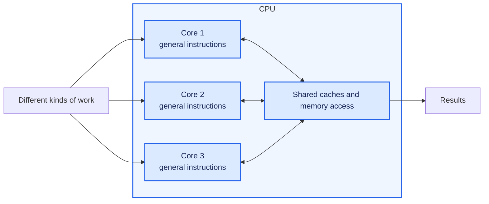
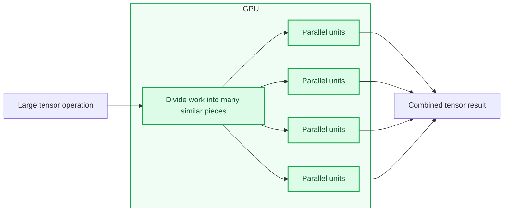
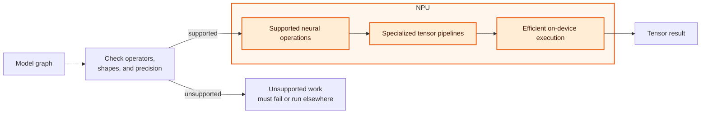
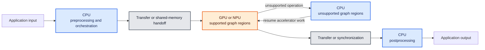
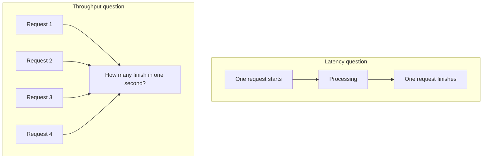
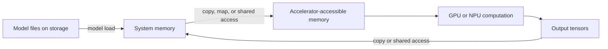
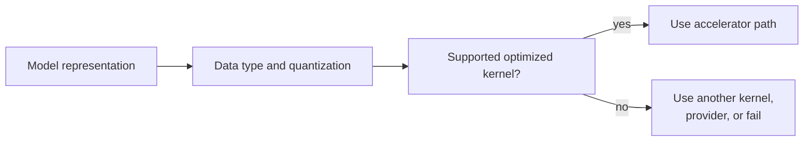
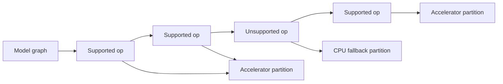
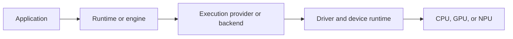
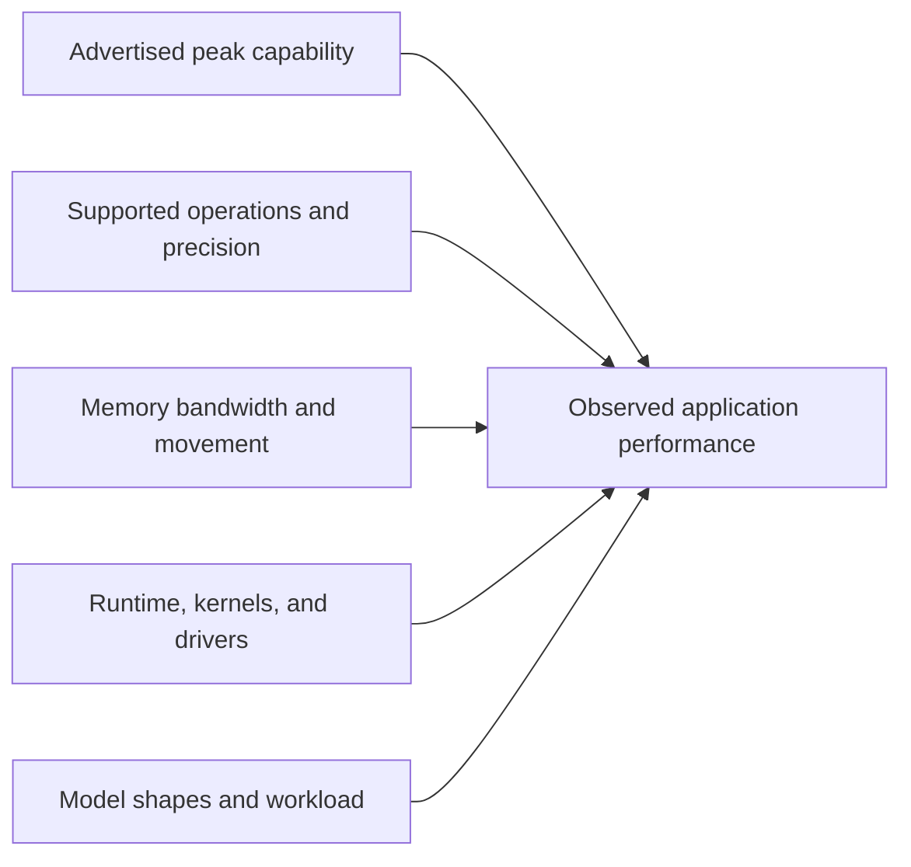

# 04 - CPU, GPU, and NPU

CPU, GPU, and NPU describe different kinds of processors. Each can execute
model computations, but they differ in flexibility, parallelism, supported data
types, memory behavior, power use, and software requirements.

No device type is automatically best for every model. The useful question is:

> Which device can execute this model and workload correctly, with the required
> latency, throughput, memory use, and power consumption?

## Goals

By the end of this lesson, you should be able to:

1. describe the main architectural strengths of CPUs, GPUs, and NPUs;
2. distinguish device presence from runtime availability and actual execution;
3. explain how parallelism, memory movement, precision, and operator support
   affect device selection;
4. explain latency, throughput, utilization, power, and TOPS without treating
   them as interchangeable;
5. interpret the lab's hardware snapshot and device expectation templates;
6. identify the runtime evidence needed to support an acceleration claim; and
7. create a hardware baseline that can be used in later experiments.

This lesson discovers hardware but does not run a model. It cannot prove that a
CPU, GPU, or NPU executed inference.

## Before you begin

Open PowerShell in the repository root and activate the environment used in the
previous lessons:

```powershell
.\.venv\Scripts\Activate.ps1
```

Confirm that the lab is available:

```powershell
python -m local_ai_lab --help
```

If Python reports `No module named local_ai_lab`, verify that the active Python
path ends with `.venv\Scripts\python.exe`:

```powershell
python -c "import sys; print(sys.executable)"
```

## The three device types

### CPU

A **central processing unit (CPU)** is a general-purpose processor. It is
designed to handle varied instructions, branches, operating-system work, and
application control flow.

Modern CPUs contain multiple cores, vector instructions, caches, and optimized
math libraries. They are often a practical inference choice when:

- the model or workload is small;
- batch size is low;
- startup overhead matters;
- the graph contains unsupported or control-heavy operations;
- portability is more important than maximum accelerator throughput; or
- most request time is spent outside model execution—for example, resizing an
  image, tokenizing text, applying business rules, or formatting the result.



The visual is conceptual, not a literal CPU diagram. A CPU has relatively few
powerful, flexible cores compared with the many simpler parallel units exposed
by accelerator architectures.

### GPU

A **graphics processing unit (GPU)** is designed to perform large amounts of
similar work in parallel. Model operations such as matrix multiplication,
convolution, and elementwise tensor calculations can map well to this design.

GPUs are often effective when:

- the graph contains highly parallel operations;
- tensors are large enough to keep many compute units busy;
- the runtime provides optimized kernels for the model's operations;
- data can remain in GPU-accessible memory across operations; and
- enough work is available to offset dispatch and transfer overhead.



A GPU can be underused by a very small workload, frequent synchronization,
unsupported operations, or repeated transfers between CPU and GPU memory.

### NPU

A **neural processing unit (NPU)** is a specialized accelerator designed for
supported neural-network operations, usually with an emphasis on efficient
local inference.

A **neural-network operation** is one computation step in a model graph. Examples
include matrix multiplication, convolution, activation functions, normalization,
and combining tensors. A complete model contains many connected operations.
An NPU can execute only the operations whose data types, tensor shapes, layouts,
and options its hardware and software stack support.

NPUs can be effective when:

- the model uses supported operators, tensor shapes, and layouts;
- its data types and quantization match the NPU's optimized paths;
- the runtime has a compatible NPU execution provider or backend;
- enough of the graph can remain on the NPU; and
- power efficiency or sustained local execution matters.



An NPU is specialized, not universally faster. A model that does not meet its
operator, shape, layout, or precision requirements may be partitioned across
devices, fall back to the CPU, or fail to load.

## Compare the devices

| Characteristic | CPU | GPU | NPU |
|---|---|---|---|
| Main design goal | Flexible general computation | High parallel throughput | Efficient supported neural computation |
| Relative flexibility | Highest | Medium | Most specialized |
| Parallel tensor work | Good with vectorized libraries | Often excellent | Often excellent on supported paths |
| Control-heavy work | Strong | Less suitable | Usually limited |
| Typical precision support | Broad | Hardware and backend dependent | Often optimized for selected lower-precision types |
| Software path | CPU runtime kernels | GPU backend or EP plus driver | NPU backend or EP plus driver |
| Common risk | Lower throughput for large models | Transfer and dispatch overhead | Unsupported operators, shapes, or precision |
| Useful default | Broad compatibility and fallback | Parallel workloads | Qualified, efficiency-focused inference |

These are tendencies, not benchmark results. Actual performance depends on the
specific processor, model, runtime, provider, configuration, and workload.

## One inference request can use several processors

An application can use the CPU for orchestration and preprocessing even when
model operations run on an accelerator. A runtime can also partition a graph
because one device does not support every operation.



The accelerator can still be used even when the CPU is active. The important
questions are:

- which operations ran on each provider;
- how often data moved or execution synchronized;
- whether fallback was expected;
- whether those costs improved or harmed the complete request; and
- whether the result still met correctness requirements.

Lesson 5 examines execution providers and graph partitioning in detail.

## Parallelism and workload shape

### Latency and throughput

**Latency** is the elapsed time for one unit of work, such as one inference
request or one generated token.

**Throughput** is the amount of work completed per unit of time, such as images
per second, requests per second, or tokens per second.



A system can have high throughput but poor single-request latency, or low
latency for one request but limited total throughput. Always state which metric
you measured.

### Batch size

A batch groups multiple inputs into one runtime call. Larger batches can expose
more parallel work and improve throughput, especially on a GPU. They also
increase memory use and can make an individual request wait longer.

Interactive generation commonly uses small batches, while offline image or
embedding workloads may use larger batches. The same device can behave
differently under those workloads.

### Tensor shapes

Tensor dimensions determine how much work is available and whether optimized
kernels apply. Some accelerators prefer or require fixed shapes. Dynamic input
lengths can trigger different kernels, additional compilation, padding, or an
unsupported path.

Record important shapes when comparing devices:

- batch size;
- image dimensions;
- audio duration;
- prompt length;
- context length; and
- generated token count.

## Memory and data movement

Model execution reads weights and intermediate tensors. Those values must be
available in memory accessible to the selected processor.



Depending on the platform, CPU and accelerator memory may be physically
separate, shared, or exposed through a unified memory architecture. Even with
shared physical memory, synchronization, layout conversion, and cache movement
can have a cost.

Important memory considerations include:

- whether model weights fit in available memory;
- memory bandwidth while reading weights;
- intermediate activation size;
- KV-cache growth during text generation;
- copies between providers or devices;
- tensor layout and data-type conversion; and
- memory used by concurrent requests.

An accelerator's compute capacity cannot help while it is waiting for data.

## Precision and quantization

Processors support different numeric formats and accelerate them differently.
Common representations include FP32, FP16, BF16, INT8, and lower-bit
quantization schemes.



Lower precision can reduce model size, memory bandwidth, and compute cost. It
does not guarantee better performance. The runtime still needs compatible
kernels, and conversions or fallback can erase the expected benefit.

Precision can also change numerical results. Performance comparisons should
record the exact representation and verify output correctness.

## Operator support, graph partitioning, and fallback

A model graph contains operations. A runtime asks a provider which operations
it supports under the model's shapes, data types, and options.



Fallback can preserve correctness and make more models runnable. It can also add
transfers and synchronization that reduce performance.

For normal application use, fallback may be acceptable. For device
qualification, silent fallback can invalidate a claim such as "the whole model
ran on the NPU." In that case, disable fallback when supported and inspect a
per-operation profile.

## Drivers, providers, and the software chain

Physical hardware needs a complete software path:



A missing or incompatible layer can prevent acceleration even when Windows
detects the device.

| Observation | What it establishes |
|---|---|
| Windows lists the device | The OS reports a present device |
| Driver status is `OK` | Windows reports that the device/driver is functioning |
| Runtime lists an EP | The installed runtime exposes that provider |
| Session lists the requested EP | The model session initialized with that provider |
| Profile maps operations to the EP | Specific graph operations executed through that provider |
| Device telemetry changes during the run | The device was active during the measured interval |

No single row establishes every other row.

## Performance terms

### Utilization

Utilization estimates how busy a device was during an interval. It does not
directly measure useful model work. A device can show high utilization because
of another process, inefficient kernels, or data movement.

Conversely, a short request can finish before a low-frequency utilization
sampler captures it. Treat missing telemetry as unavailable evidence, not zero
utilization.

### TOPS and FLOPS

- **FLOPS** describes floating-point operations per second.
- **OPS** describes operations per second under a stated operation definition.
- **TOPS** means trillions of operations per second.

Advertised peak TOPS is a theoretical hardware capability measured under
specific data types and assumptions. It is not tokens per second, requests per
second, or guaranteed application performance.



Peak capability is only one input to observed performance.

### Power and thermals

Performance can change during a long run as power and temperature limits change
clock speeds. A short burst and a sustained workload can therefore produce
different results.

For repeatable comparisons, record:

- power mode and whether the machine is plugged in;
- warm-up procedure;
- run duration;
- concurrent applications;
- device temperature or throttling when observable; and
- whether samples are cold or warm.

## Step 1: Capture the hardware snapshot

Run:

```powershell
python -m local_ai_lab hardware --output results\hardware.json
```

The command prints a JSON snapshot and saves the same data to
`results\hardware.json`.

A shortened example is:

```json
{
  "os": {
    "caption": "Microsoft Windows 11 Enterprise",
    "buildnumber": "28000",
    "osarchitecture": "ARM 64-bit Processor"
  },
  "architecture": "ARM64",
  "cpu": {
    "name": "Example Processor",
    "physical_cores": 12,
    "logical_cores": 12
  },
  "memory_bytes": 68165767168,
  "devices": [
    {
      "kind": "NPU",
      "name": "Example Neural Processor",
      "status": "OK",
      "source": "os-reported"
    },
    {
      "kind": "GPU",
      "name": "Example Graphics Adapter",
      "status": "OK",
      "source": "os-reported"
    }
  ],
  "warnings": []
}
```

Your values will differ.

## Step 2: Interpret every field

| Field | Meaning | What it does not establish |
|---|---|---|
| `timestamp` | When the snapshot was captured | When a model ran |
| `os` | OS version, build, and architecture reported by Windows/Python | Runtime compatibility by itself |
| `architecture` | Architecture of the active Python process/platform | Available model or provider packages |
| `python` | Active Python version and build | That optional runtime packages are installed |
| `cpu.name` | CPU name reported by the system | CPU inference performance |
| `physical_cores` | Physical processing cores reported by `psutil` | Number of cores a runtime will use |
| `logical_cores` | Logical processors visible to the OS | Effective parallelism for a model |
| `memory_bytes` | Total system memory | Free memory or model capacity |
| `devices` | Display/compute devices found through Windows PnP | Runtime access or inference use |
| `status` | Device status reported by Windows | Successful model execution |
| `source` | Origin of the claim | Independent validation |
| `warnings` | NPU discovery uncertainty reported by the current probe | Confirmation that GPU discovery was complete |

Convert total memory to GiB if useful:

```powershell
python -c "import json; d=json.load(open(r'results\hardware.json')); print(round(d['memory_bytes'] / 1024**3, 1), 'GiB')"
```

This reports total system memory, not currently available memory and not
necessarily dedicated accelerator memory.

## Step 3: Compare observed facts with expectations

Device files under `configs\devices` describe reusable expectations. They do
not override observed hardware.

List them:

```powershell
Get-ChildItem .\configs\devices
```

Inspect the template closest to your machine, if one exists:

```powershell
Get-Content .\configs\devices\snapdragon_x2_elite.yaml
```

Example:

```yaml
id: snapdragon_x2_elite_reference
description: Reference expectations only; run `hardware` for observed facts.
os: Windows 11
architecture: ARM64
cpu_family: Snapdragon X2 Elite
expected_devices:
  - Qualcomm Adreno GPU
  - Qualcomm Hexagon NPU
warning: Device presence never proves workload placement.
```

Classify the information:

| Claim | Classification |
|---|---|
| The template expects an Adreno GPU | Configured expectation |
| `hardware.json` contains a GPU entry | Observed OS inventory |
| A runtime exposes a compatible GPU backend | Unknown from `hardware` |
| The GPU executed model operations | Unknown from `hardware` |
| The template expects a Hexagon NPU | Configured expectation |
| `hardware.json` contains an NPU entry | Observed OS inventory |
| The NPU executed the complete graph | Unknown from `hardware` |

If the expectation and snapshot differ, record the mismatch. Do not edit the
observed output to match the template.

## Step 4: Build an evidence ladder

For each accelerator, fill in this table:

| Evidence level | GPU | NPU |
|---|---|---|
| Device reported by Windows | Record snapshot evidence | Record snapshot evidence |
| Compatible driver present | Record driver evidence or unknown | Record driver evidence or unknown |
| Runtime/backend installed | Record runtime probe or unknown | Record runtime probe or unknown |
| Backend/EP available | Record provider list or unknown | Record provider list or unknown |
| Model session initialized | Record session report or not tested | Record session report or not tested |
| Operations assigned | Record profile or not tested | Record profile or not tested |
| Measured device activity | Record telemetry or unavailable | Record telemetry or unavailable |
| Correct output produced | Record correctness check or not tested | Record correctness check or not tested |

In this lesson, only the first row is normally complete. Later lessons add
runtime and execution evidence.

## Step 5: Match evidence to each inference path

Use this worksheet:

| Inference path | Evidence needed before claiming CPU/GPU/NPU execution |
|---|---|
| Windows AI API | API readiness plus the API's documented hardware contract |
| Foundry Local | Selected catalog variant, registered EP/backend, and runtime evidence |
| Windows ML | Ready EP registration, session providers, and operation profile |
| Direct ONNX Runtime | Session provider list plus per-operation profiling; disable fallback when qualifying complete offload |
| ORT GenAI | Provider configuration plus runtime/session logs or profile from the underlying ORT execution |
| llama.cpp | Startup logs naming the backend/device, offload or buffer allocation, and runtime timings |
| Cloud inference | No local-device claim; use provider-supplied hardware evidence if available |

Do not substitute Windows Task Manager alone for runtime evidence. It can support
a claim by showing activity, but it does not map individual model operations to
a provider.

## Step 6: Create your hardware worksheet

Complete this table with your own snapshot:

| Item | Observed value | Evidence source | What remains unknown |
|---|---|---|---|
| OS/build |  | `hardware.json` | Runtime compatibility |
| Python architecture |  | `hardware.json` | Availability of architecture-specific packages |
| CPU |  | `hardware.json` | Model performance and core use |
| Physical/logical cores |  | `hardware.json` | Runtime thread configuration |
| Total memory |  | `hardware.json` | Free and accelerator-dedicated memory |
| GPU |  | `hardware.json` | Backend availability and operation placement |
| NPU |  | `hardware.json` | Backend availability and operation placement |

Then write one supported conclusion:

> Windows reports the following processors on this machine: ____. This snapshot
> does not show whether any inference runtime can use them or whether a model ran
> on them.

## Common mistakes

### "Windows detects my NPU, so ORT can use it"

Windows device detection and ORT provider availability are separate. ORT needs
a compatible provider distribution, driver path, and supported model.

### "My GPU or NPU shows 0% utilization, so it was not used"

A monitoring tool can miss a short workload, display the wrong engine, or
sample too slowly. Treat the reading as one piece of telemetry, not definitive
per-operation evidence.

### "My GPU or NPU shows activity, so the whole model ran there"

Activity can come from another process or only part of the graph. Use runtime
provider reports and profiling to identify model operation placement.

### "Higher TOPS means a faster model"

TOPS is a theoretical operation rate under particular assumptions. Model
throughput also depends on operator support, precision, memory bandwidth,
software, shapes, transfers, and fallback.

### "An NPU is a small GPU"

Both can accelerate parallel tensor work, but they expose different
architectures, supported operations, precision paths, software stacks, and
performance goals.

### "CPU fallback is always bad"

Fallback can make a model run correctly when an accelerator cannot execute an
operation. It becomes a problem when transfers outweigh acceleration or when
the goal is to prove complete accelerator offload.

### "More utilization always means better performance"

Utilization measures activity, not completed useful work. Compare latency,
throughput, correctness, memory, and power under the same workload.

## Troubleshooting

### No GPU or NPU appears

Confirm that Windows Device Manager lists the device and that its driver is
installed. The lab uses Windows PnP discovery and may not recognize every device
name or class. The current probe adds a warning when it does not detect an NPU;
it does not add an equivalent missing-GPU warning. An empty warning list
therefore does not prove that GPU discovery was complete.

The probe infers `GPU` or `NPU` from the Windows PnP class and device name.
Unusual names or device classes can be mislabeled. Preserve the reported
`name`, `kind`, and raw snapshot, and compare uncertain entries with Device
Manager.

### The architecture is unexpected

`architecture` reflects the active Python/platform view. Confirm the executable:

```powershell
python -c "import platform, sys; print(platform.machine()); print(sys.executable)"
```

Use a native Python build for the machine architecture when required by the
runtime.

### The JSON cannot be saved

Run from the repository root and confirm that the `results` directory is
writable:

```powershell
New-Item -ItemType Directory -Force .\results
python -m local_ai_lab hardware --output results\hardware.json
```

Generated results are ignored by Git, so machine-specific data remains local.

### The snapshot contains duplicate or unexpected devices

Windows can expose virtual displays, remote adapters, or multiple device
interfaces. Preserve the raw snapshot and label uncertain entries rather than
deleting evidence.

## Completion check

You are ready for Lesson 5 when all of the following are true:

- `python -m local_ai_lab hardware --output results\hardware.json` completes;
- you have recorded the OS, Python architecture, CPU, memory, GPU, and NPU
  entries reported for your machine;
- you can explain the main workload strengths and limitations of CPU, GPU, and
  NPU devices;
- you can explain why data movement, shapes, precision, and unsupported
  operations can change accelerator performance;
- you can distinguish latency, throughput, utilization, and TOPS;
- your evidence ladder separates device presence, provider availability,
  session initialization, operation placement, telemetry, and correctness;
- you can name the additional evidence required for at least two inference
  paths; and
- you label the actual execution device as **unknown** because this lesson did
  not run or profile a model.

Expected conclusion:

> The operating system reports which processors are present. A compatible
> runtime and backend are required to use them, and runtime profiling is
> required to show where model operations actually executed.

Keep `results\hardware.json`; Lesson 5 will connect the hardware baseline to
execution providers and graph placement.
