# 04 - CPU, GPU, and NPU

CPU, GPU, and NPU describe different kinds of processors. Each can execute
model computations, but they differ in flexibility, parallelism, supported data
types, memory behavior, power use, and software requirements.

No device type is automatically best for every model. The useful question is:

> Which device can execute this model and workload correctly, with the required
> latency, throughput, memory use, and power consumption?

## Goals

By the end of this lesson, you should be able to:

1. describe the main architectural strengths of CPUs, GPUs, and NPUs;
2. explain why GPUs and NPUs can support the same operation names but different
   operation variants;
3. explain how parallelism, batching, and workload shape affect device fit;
4. distinguish dedicated, shared, managed, and coherent memory arrangements;
5. explain how memory movement, precision, and operator support
   affect device selection;
6. explain latency, throughput, utilization, power, and TOPS without treating
   them as interchangeable;
7. predict how fallback, page migration, and throttling can affect performance;
   and
8. form a justified starting-device hypothesis for a described workload.

This is a conceptual lesson. It requires no command, model download, or
machine-specific hardware. The exercise uses only information presented below.

## The three device types

### CPU

A **central processing unit (CPU)** is a general-purpose processor. It is
designed to handle varied instructions, branches, operating-system work, and
application control flow.

Modern CPUs contain multiple cores, vector instructions, caches, and optimized
math libraries. They are often a practical inference choice when:

- the model or workload is small;
- batch size is low;
- startup overhead matters;
- the graph contains unsupported or control-heavy operations;
- portability is more important than maximum accelerator throughput; or
- most request time is spent outside model execution—for example, resizing an
  image, tokenizing text, applying business rules, or formatting the result.

**CPU memory:** The CPU normally reads system memory directly. Small, fast
on-chip caches retain recently used data, while larger model weights and tensors
remain in system RAM. CPU inference does not need to copy tensors to a separate
accelerator, but performance can still be limited by cache misses and system
memory bandwidth.

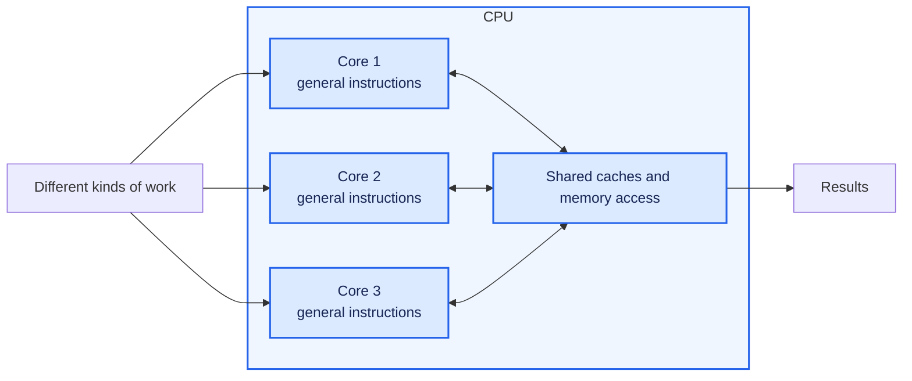

The visual is conceptual, not a literal CPU diagram. A CPU has relatively few
powerful, flexible cores compared with the many simpler parallel units exposed
by accelerator architectures.

### GPU

A **graphics processing unit (GPU)** is designed to perform large amounts of
similar work in parallel. Neural models contain operations such as matrix
multiplication, convolution, activation, normalization, and elementwise tensor
calculations. A GPU can execute many variants of these operations through
programmable parallel kernels. Its backend can select or generate kernels for
many combinations of shapes, data types, layouts, and operation parameters.

GPUs are often effective when:

- the graph contains highly parallel operations;
- tensors are large enough to keep many compute units busy;
- the runtime provides optimized kernels for the model's operations;
- data can remain in GPU-accessible memory across operations; and
- enough work is available to offset dispatch and transfer overhead.

**GPU memory:** A discrete GPU normally has dedicated high-bandwidth memory,
often called VRAM. Model weights and tensors must be copied or made accessible
to that memory before GPU kernels use them. An integrated GPU usually shares the
computer's physical system memory with the CPU, although the runtime still
manages ownership, synchronization, and GPU-visible allocations.

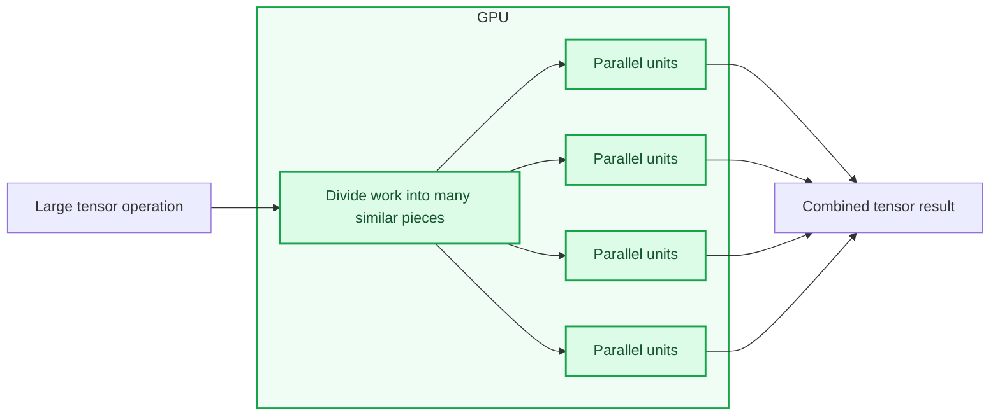

A GPU can be underused by a very small workload, frequent synchronization,
unsupported operations, or repeated transfers between CPU and GPU memory.

### NPU

A **neural processing unit (NPU)** is a specialized accelerator designed for
supported neural-network operations, usually with an emphasis on efficient
local inference.

A **neural-network operation** is one computation step in a model graph. An NPU
works on the same general kinds of operations listed for the GPU, including
matrix multiplication, convolution, activation, normalization, and elementwise
tensor calculations. However, it maps only supported variants of those
operations onto its specialized neural-compute paths. A complete model contains
many connected operations, and every operation has specific shapes, data types,
layouts, and parameters.

Some operation names appear in both the GPU and NPU sections because both
devices can perform parts of the same neural model. The difference is not simply
**which operation name** appears in the graph. The difference is the range of
variants each device can execute:

- a GPU is a broadly programmable parallel processor, so its backend can provide
  kernels for many workloads beyond neural inference and for many tensor
  configurations;
- an NPU provides specialized neural-compute paths, so its provider normally
  accepts a narrower set of operation variants, data types, shapes, layouts, and
  combinations; and
- the NPU can be more power-efficient when a graph matches those specialized
  paths, while the GPU can remain usable across a broader range of parallel
  workloads.

For example, both devices may support an operation called `MatMul`, but that
does not imply identical support:

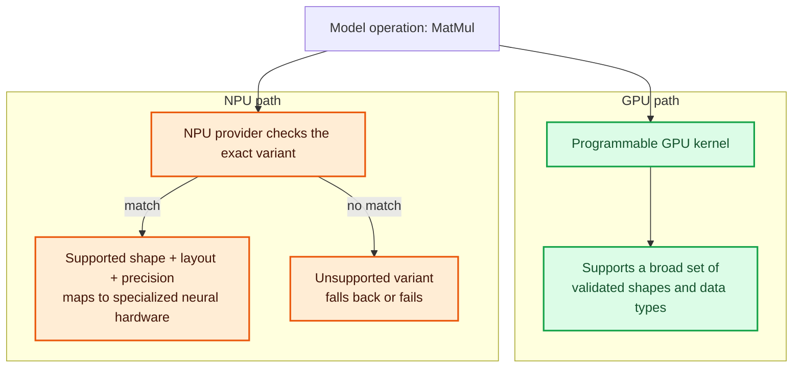

The operation name is only the starting point. Provider support depends on the
complete operation definition and surrounding graph. An NPU can execute only
the variants that its hardware and software stack support.

NPUs can be effective when:

- the model uses supported operators, tensor shapes, and layouts;
- its data types and quantization match the NPU's optimized paths;
- the runtime has a compatible NPU execution provider or backend;
- enough of the graph can remain on the NPU; and
- power efficiency or sustained local execution matters.

**NPU memory:** PC NPUs are commonly integrated into the processor package and
use system memory for model weights and tensors rather than having large
dedicated memory like a discrete GPU. They also use small, fast on-chip memory
for data being actively processed. The NPU driver and runtime decide how tensors
are allocated, mapped, synchronized, and moved between system memory and those
on-chip buffers.

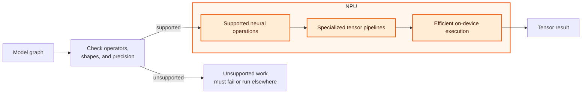

An NPU is specialized, not universally faster. A model that does not meet its
operator, shape, layout, or precision requirements may be partitioned across
devices, fall back to the CPU, or fail to load.

## Compare the devices

| Question | CPU | GPU | NPU |
|---|---|---|---|
| What is it designed for? | Many kinds of general computation | Large amounts of parallel computation | Efficient execution of supported neural-model operations |
| How flexible is it? | Most flexible: handles the widest range of work | Flexible for many parallel workloads | Least flexible: accepts a narrower set of neural operations and tensor configurations |
| How does it execute model work? | General instructions and vectorized math libraries | Programmable parallel kernels | Provider maps supported graph regions to specialized neural-compute paths |
| How well does it handle large parallel tensor operations? | Often adequate, but may have lower throughput | Often very strong | Often very strong when the exact operation variant is supported |
| How well does it handle branching or sequential control flow? | Strong | Usually less efficient than CPU | Usually limited |
| Which numeric formats does it support well? | Broad support; performance varies by CPU instructions | Depends on GPU hardware and backend kernels | Usually optimized for selected formats such as FP16 or INT8; exact support varies |
| What memory does it commonly use? | System RAM and CPU caches | Dedicated VRAM on discrete GPUs; shared system memory on integrated GPUs | Commonly shared system memory plus small on-chip buffers |
| What software is required? | Runtime CPU kernels | Compatible GPU backend or EP and driver | Compatible NPU backend or EP and driver |
| What is the main limitation? | May provide lower throughput for large parallel models | Dispatch, transfer, synchronization, and VRAM-capacity costs | Unsupported operations, shapes, layouts, or precision can cause fallback or failure |
| When is it a practical choice? | Broad compatibility, small workloads, and fallback | Models with enough supported parallel work | Qualified models where efficient local inference is important |

These are tendencies, not benchmark results. Actual performance depends on the
specific processor, model, runtime, provider, configuration, and workload.

## One inference request can use several processors

An application can use the CPU for orchestration and preprocessing even when
model operations run on an accelerator. A runtime can also partition a graph
because one device does not support every operation.

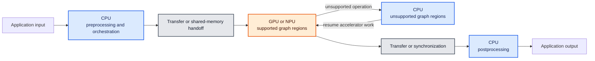

The accelerator can still be used even when the CPU is active. The important
questions are:

- which operations ran on each provider;
- how often data moved or execution synchronized;
- whether fallback was expected;
- whether those costs improved or harmed the complete request; and
- whether the result still met correctness requirements.

Lesson 5 examines execution providers and graph partitioning in detail.

## Parallelism and workload shape

### Latency and throughput

**Latency** is the elapsed time for one unit of work, such as one inference
request or one generated token.

**Throughput** is the amount of work completed per unit of time, such as images
per second, requests per second, or tokens per second.

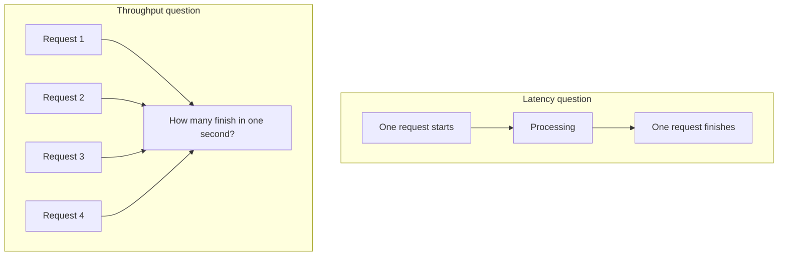

A system can have high throughput but poor single-request latency, or low
latency for one request but limited total throughput. Always state which metric
you measured.

### Batch size

A batch groups multiple inputs into one runtime call. Larger batches can expose
more parallel work and improve throughput, especially on a GPU. They also
increase memory use and can make an individual request wait longer.

Interactive generation commonly uses small batches, while offline image or
embedding workloads may use larger batches. The same device can behave
differently under those workloads.

### Tensor shapes

Tensor dimensions determine how much work is available and whether optimized
kernels apply. Some accelerators prefer or require fixed shapes. Dynamic input
lengths can trigger different kernels, additional compilation, padding, or an
unsupported path.

Record important shapes when comparing devices:

- batch size;
- image dimensions;
- audio duration;
- prompt length;
- context length; and
- generated token count.

## Memory and data movement

Model execution reads weights and intermediate tensors. Those values must be
available in memory accessible to the selected processor.

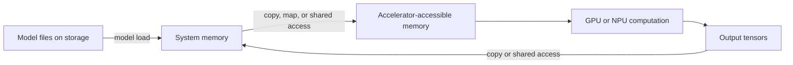

Depending on the platform, CPU and accelerator memory may be physically
separate, shared, or exposed through a unified memory architecture. Even with
shared physical memory, synchronization, layout conversion, and cache movement
can have a cost.

### Four memory terms that are easy to confuse

| Term | Physical arrangement | What software must manage |
|---|---|---|
| **System memory** | RAM primarily used by the CPU and operating system | Allocation, caching, and access by processes |
| **Dedicated GPU memory (VRAM)** | Separate memory physically attached to a discrete GPU | Transfers or mappings between system RAM and VRAM |
| **Physically shared or unified memory** | CPU and integrated accelerators use the same physical memory pool | Device-visible allocations, synchronization, caches, and layouts |
| **Managed or virtual unified memory** | One address-space abstraction can span physically separate memories | The driver/runtime migrates or maps data to the processor that needs it |

These terms describe different properties. A shared address space does not
necessarily mean shared physical memory, and shared physical memory does not
mean that every processor can access every allocation without coordination.

### Discrete GPU memory

Most discrete GPUs, including typical NVIDIA GeForce and RTX add-in GPUs, have
their own VRAM:

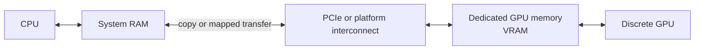

Keeping weights and intermediate tensors in VRAM avoids repeated transfers.
When a model does not fit, software may move data between RAM and VRAM, reduce
the model or batch size, or place some work on the CPU. Those choices can have a
large performance cost.

### Integrated GPU and NPU memory

Integrated GPUs and NPUs commonly share the system's physical memory pool with
the CPU:

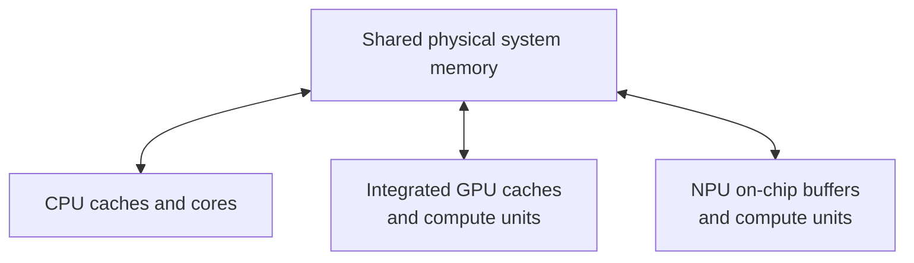

This can avoid a full copy into separate VRAM, but it is not zero-cost. The CPU,
GPU, and NPU can have different caches, tensor layouts, alignment requirements,
and synchronization rules. They also compete for memory capacity and bandwidth.

The exact architecture varies by product. Do not assume that every NPU shares
memory in the same way or that it can directly consume any CPU allocation.

### What NVIDIA "Unified Memory" means

NVIDIA systems use several memory arrangements. They are not simply three
generations in which each new arrangement replaces the previous one. Modern
discrete GPUs still use dedicated VRAM, and CUDA Unified Memory is a software
model that can operate on top of physically separate memory.

#### 1. Discrete GPU with explicit memory placement

Examples include desktop GeForce RTX cards such as the RTX 5090 and PCIe
data-center GPUs such as the H100 PCIe.

The CPU uses system RAM, while the GPU uses physically separate VRAM.
Applications or runtime libraries allocate GPU memory and explicitly transfer
the required weights and tensors.

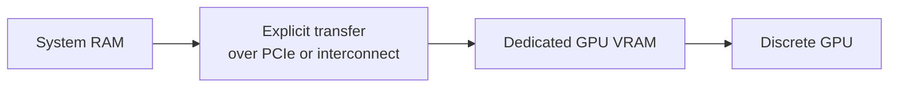

Effects:

- **Latency:** an initial or repeated transfer adds latency, but planned copies
  are relatively predictable and can sometimes overlap with computation.
- **Capacity:** the active model data normally needs to fit in VRAM unless the
  application deliberately offloads or streams data.
- **Throughput:** keeping active tensors in VRAM avoids repeated transfers and
  helps the GPU sustain work. Insufficient VRAM can force offloading or smaller
  batches, reducing total work completed per second.

#### 2. CUDA Unified Memory over separate RAM and VRAM

CUDA-capable discrete GPUs can use **CUDA Unified Memory**, also called managed
memory. CPU and GPU code use one managed allocation and a unified virtual
address space, while system RAM and GPU VRAM remain physically separate. The
CUDA driver maps, prefetches, or migrates memory pages to the processor that
needs them.

The same discrete hardware can therefore use explicit placement or the Unified
Memory programming model. Examples include supported GeForce RTX and NVIDIA
data-center GPUs; exact features and behavior depend on the GPU, driver,
operating system, and interconnect.

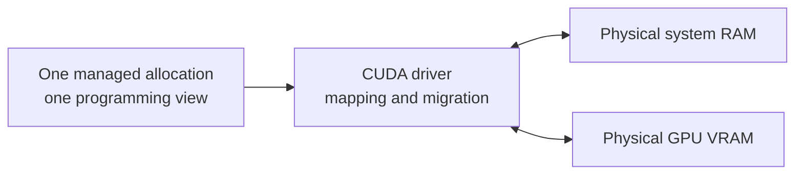

Effects:

- **Latency:** first access to a page can trigger migration or a page fault,
  making latency less predictable. Prefetching and access hints can reduce this
  cost.
- **Capacity:** managed allocations can make data sets larger than VRAM easier
  to program, but repeatedly moving active pages between RAM and VRAM can make
  inference much slower.
- **Throughput:** managed memory can perform well while active pages remain near
  the GPU. Frequent migration or eviction consumes interconnect bandwidth,
  reduces work completed per second, and can increase tail latency.

Unified Memory improves programmability and can simplify data access. It does
not remove the physical transfer cost on a typical discrete GPU.

#### 3. Tightly coupled CPU-GPU memory

Some NVIDIA systems connect CPU and GPU memory much more closely. Two important
designs still need to be distinguished:

- **One shared physical memory pool:** NVIDIA Jetson systems, such as Jetson AGX
  Orin, use system-on-chip designs where CPU and integrated GPU share physical
  DRAM. NVIDIA DGX Spark with the GB10 Superchip is another example marketed
  with coherent unified system memory.
- **Coherent access across distinct memory pools:** NVIDIA Grace Hopper systems
  combine Grace CPU LPDDR memory and Hopper GPU HBM. The pools remain
  physically distinct, but a coherent high-bandwidth NVLink-C2C connection
  allows each processor to access the other's memory through one address space.

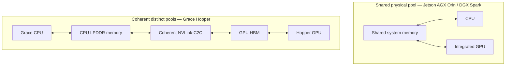

Effects:

- **Latency:** avoiding a bulk PCIe copy can reduce transfer overhead. Accessing
  memory attached to the other processor can still be slower than using local
  cache or local high-bandwidth memory.
- **Capacity:** a larger CPU-GPU-visible memory space can accommodate larger
  models, longer contexts, or more resident model data.
- **Throughput:** reduced copy overhead and a larger visible memory space can
  keep the processors supplied with work. Throughput is still limited by local
  and remote memory bandwidth, cache behavior, compute, and runtime scheduling.
- **Placement still matters:** shared or coherent access does not make every
  memory location equally fast. Runtimes can still improve performance by
  placing frequently used tensors near the processor that consumes them.

More available memory can permit larger batches or more **concurrent** requests,
which may increase throughput. Once compute or memory bandwidth is saturated,
additional concurrency mainly increases queueing, contention, and latency.

On Windows, Task Manager's **Shared GPU memory** usually means system RAM that
Windows can make available to the GPU. It is not the same term as CUDA Unified
Memory, and it does not turn a discrete GPU's VRAM and system RAM into one
physical memory pool.

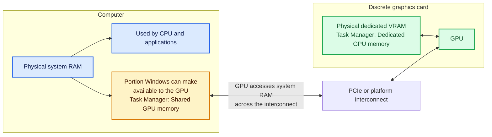

The yellow box remains part of physical system RAM. Windows reports it as
**shared GPU memory** because the GPU can use it when needed. The green VRAM box
is separate memory physically attached to the graphics card. Accessing shared
GPU memory can be slower than accessing local VRAM because data travels across
the interconnect and competes with other system-memory traffic.

Important memory considerations include:

- whether model weights fit in available memory;
- memory bandwidth while reading weights;
- intermediate activation size;
- KV-cache growth during text generation;
- copies between providers or devices;
- tensor layout and data-type conversion; and
- memory used by concurrent requests.

An accelerator's compute capacity cannot help while it is waiting for data.

## Precision and quantization

Processors support different numeric formats and accelerate them differently.
Common representations include FP32, FP16, BF16, INT8, and lower-bit
quantization schemes.

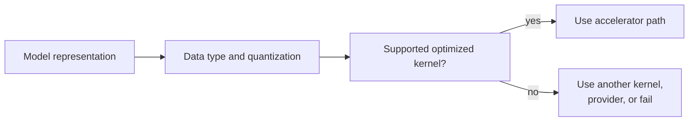

Lower precision can reduce model size, memory bandwidth, and compute cost. It
does not guarantee better performance. The runtime still needs compatible
kernels, and conversions or fallback can erase the expected benefit.

Precision can also change numerical results. Performance comparisons should
record the exact representation and verify output correctness.

## Operator support, graph partitioning, and fallback

A model graph contains operations. A runtime asks a provider which operations
it supports under the model's shapes, data types, and options.

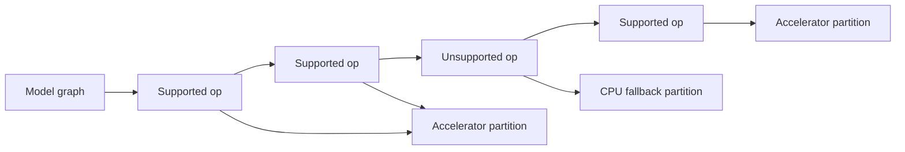

Fallback can preserve correctness and make more models runnable. It can also add
transfers and synchronization that reduce performance.

For normal application use, fallback may be acceptable. For device
qualification, silent fallback can invalidate a claim such as "the whole model
ran on the NPU." In that case, disable fallback when supported and inspect a
per-operation profile.

## Drivers, providers, and the software chain

Physical hardware needs a complete software path:

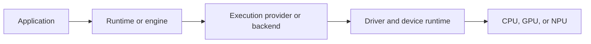

A missing or incompatible layer can prevent acceleration even when Windows
detects the device.

| Observation | What it establishes |
|---|---|
| Windows lists the device | The OS reports a present device |
| Driver status is `OK` | Windows reports that the device/driver is functioning |
| Runtime lists an EP | The installed runtime exposes that provider |
| Session lists the requested EP | The model session initialized with that provider |
| Profile maps operations to the EP | Specific graph operations executed through that provider |
| Device telemetry changes during the run | The device was active during the measured interval |

No single row establishes every other row.

## Performance terms

### Utilization

Utilization estimates how busy a device was during an interval. It does not
directly measure useful model work. A device can show high utilization because
of another process, inefficient kernels, or data movement.

Conversely, a short request can finish before a low-frequency utilization
sampler captures it. Treat missing telemetry as unavailable evidence, not zero
utilization.

### TOPS and FLOPS

- **FLOPS** describes floating-point operations per second.
- **OPS** describes operations per second under a stated operation definition.
- **TOPS** means trillions of operations per second.

Advertised peak TOPS is a theoretical hardware capability measured under
specific data types and assumptions. It is not tokens per second, requests per
second, or guaranteed application performance.

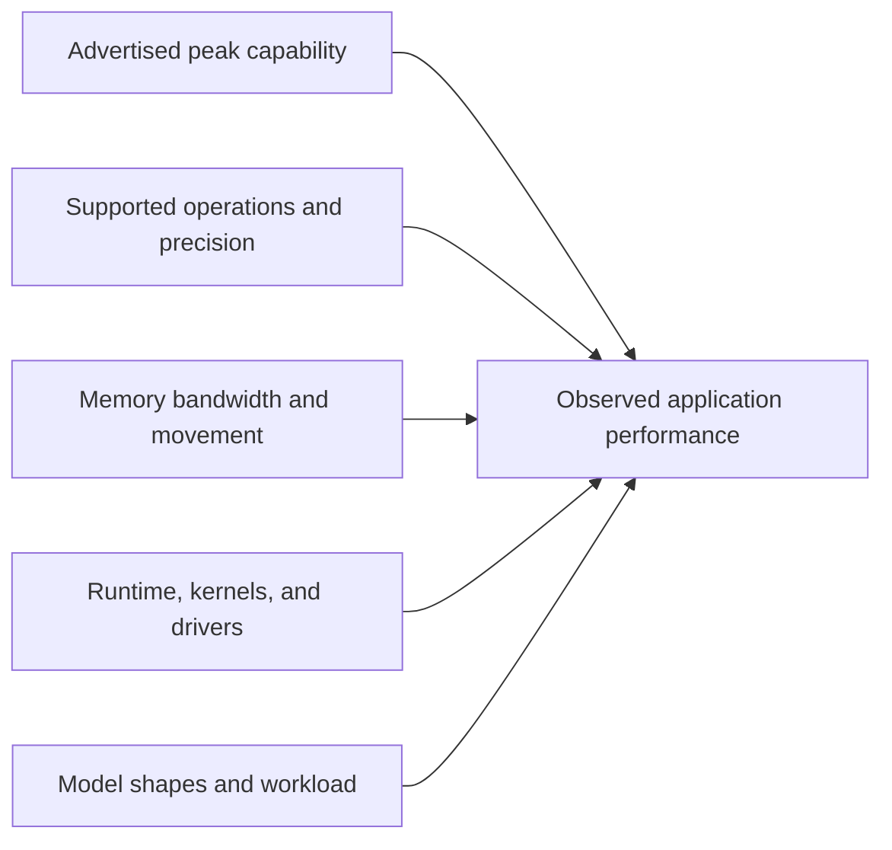

Peak capability is only one input to observed performance.

### Power and thermals

Processors produce heat and consume power while working. If a processor becomes
too hot or reaches its power limit, the system may reduce its clock speed to
protect the hardware. Clock speed controls how many processing cycles the
processor attempts each second. A lower clock speed means fewer cycles per
second, which reduces heat and power use but usually makes the workload run more
slowly. This slowdown is called **throttling**. A short test may finish before
throttling begins, while a longer test may run more slowly.

For example, a processor may slow from 3.0 GHz to 2.0 GHz when it becomes too
hot.

For repeatable comparisons, record:

- power mode and whether the machine is plugged in;
- warm-up procedure;
- run duration;
- concurrent applications;
- device temperature or throttling when observable; and
- whether samples are cold or warm.

## Exercise: choose a starting device

This exercise uses only information presented in this lesson. You do not need
to run a command, inspect your computer, or research a hardware product.

The goal is not to declare a guaranteed winner. The goal is to form a justified
**starting hypothesis** and identify what could make that choice perform poorly.

### Workload A: interactive rules-heavy classifier

- One small request arrives at a time.
- The model uses small tensors and several branches.
- Custom preprocessing and business rules run before and after the model.
- Everything fits in system RAM.
- The priority is low latency for one request.

### Workload B: offline image classification

- The application processes thousands of same-size images.
- It can submit batches of 64 images.
- Most model work is convolution and matrix multiplication.
- Optimized GPU kernels support the complete graph.
- The model and batch fit in dedicated VRAM.
- The priority is images processed per second.

### Workload C: always-on audio detection

- Audio arrives continuously in fixed-size windows.
- The model uses static shapes and INT8 operations.
- Every operation variant is supported by the NPU provider.
- The model fits in shared system memory and the NPU's working buffers.
- The device must remain within a low power budget.

### Workload D: large interactive language model

- One user generates text at a time.
- The weights and growing KV cache exceed the discrete GPU's VRAM.
- CUDA Unified Memory can migrate pages between system RAM and VRAM.
- The prompt length varies.
- The priority is responsive token generation.
- No measured latency or throughput is provided.

### Part 1: complete the worksheet

For each workload, fill in:

| Workload | Best starting candidate | Priority metric | Why it may fit | Main risk or limitation |
|---|---|---|---|---|
| A |  |  |  |  |
| B |  |  |  |  |
| C |  |  |  |  |
| D |  |  |  |  |

Use these rules:

1. Select a device only when the scenario provides enough support.
2. Write **benchmark required** when the information does not justify one
   device.
3. Include memory behavior in every explanation.
4. Do not use peak TOPS as proof of application performance.

### Part 2: explain what changes

Answer each question in one or two sentences:

1. If Workload B changes from batches of 64 to one image at a time, why might
   the GPU advantage shrink?
2. If one operation in Workload C is unsupported by the NPU, what two execution
   outcomes are possible?
3. Why can CUDA Unified Memory allow Workload D to run but still produce poor
   interactive latency?
4. Why might a ten-second benchmark and a ten-minute benchmark report different
   throughput?
5. Why can two devices that both support `MatMul` perform differently or accept
   different models?

### Worked answer

| Workload | Best starting candidate | Priority metric | Why it may fit | Main risk or limitation |
|---|---|---|---|---|
| A | CPU | Single-request latency | The CPU handles branches, small tensors, preprocessing, and application rules without an accelerator transfer | A larger or more parallel model could have lower throughput than on an accelerator |
| B | GPU | Images per second | A large batch exposes parallel work, optimized kernels support the graph, and tensors can remain in VRAM | Larger batches or models could exceed VRAM; transfers would reduce throughput |
| C | NPU | Sustained real-time processing within the power budget | Static INT8 work matches the stated NPU support, and the model fits its memory path | A shape, precision, or operation change could cause fallback or failure |
| D | Benchmark required | Interactive latency and tokens per second | The GPU may accelerate supported operations, but the active data exceeds VRAM | Page migration can add stalls and unpredictable latency; CPU, quantization, partial offload, and other configurations require measurement |

Part 2:

1. A single image exposes less parallel work. GPU dispatch and transfer overhead
   become a larger fraction of the request, so CPU or GPU could have lower
   latency depending on the actual model.
2. The runtime can place the unsupported operation on another provider, usually
   the CPU, or it can fail if fallback is disabled or no provider supports it.
3. Unified Memory makes a larger allocation accessible, but page faults,
   migration, and eviction between RAM and VRAM can pause generation. Those
   pauses directly harm interactive token latency.
4. A short run may finish before heat or power limits cause throttling. During a
   longer run, lower clock speeds can reduce sustained throughput.
5. The operation name is not the complete operation definition. Performance and
   support also depend on shape, layout, precision, parameters, kernel/provider
   implementation, memory bandwidth, and surrounding graph.

### What the exercise establishes

Architecture and workload characteristics help narrow the candidates:

The exercise supports a starting hypothesis, not a measured performance claim.
Actual device selection still requires a compatible software path and a
controlled benchmark.

## Common mistakes

### "Higher TOPS means a faster model"

TOPS is a theoretical operation rate under particular assumptions. Model
throughput also depends on operator support, precision, memory bandwidth,
software, shapes, transfers, and fallback.

### "An NPU is a small GPU"

Both can accelerate parallel tensor work, but they expose different
architectures, supported operations, precision paths, software stacks, and
performance goals.

### "CPU fallback is always bad"

Fallback can make a model run correctly when an accelerator cannot execute an
operation. It becomes a problem when transfers outweigh acceleration or when
the goal is to prove complete accelerator offload.

### "More utilization always means better performance"

Utilization measures activity, not completed useful work. Compare latency,
throughput, correctness, memory, and power under the same workload.

## Completion check

You are ready for Lesson 5 when all of the following are true:

- you completed the four-workload device-selection worksheet;
- you can explain the main workload strengths and limitations of CPU, GPU, and
  NPU devices;
- you can explain why a GPU and NPU can support the same operation name but not
  necessarily the same shapes, layouts, precision, or parameters;
- you can explain why data movement, shapes, precision, and unsupported
  operations can change accelerator performance;
- you can distinguish dedicated VRAM, physically shared memory, and CUDA Unified
  Memory over separate RAM and VRAM;
- you can distinguish latency, throughput, utilization, and TOPS;
- you can explain how batching, fallback, page migration, and throttling affect
  the worked scenarios; and
- you can explain why the worksheet produces a starting hypothesis rather than
  proof that one device is fastest.

Expected conclusion:

> CPU, GPU, and NPU architectures favor different workload characteristics.
> Operation support, memory behavior, precision, data movement, power, and
> workload shape identify promising candidates, but controlled measurements are
> required to select a device.

Lesson 5 explains how execution providers connect model graph operations to
these devices.
